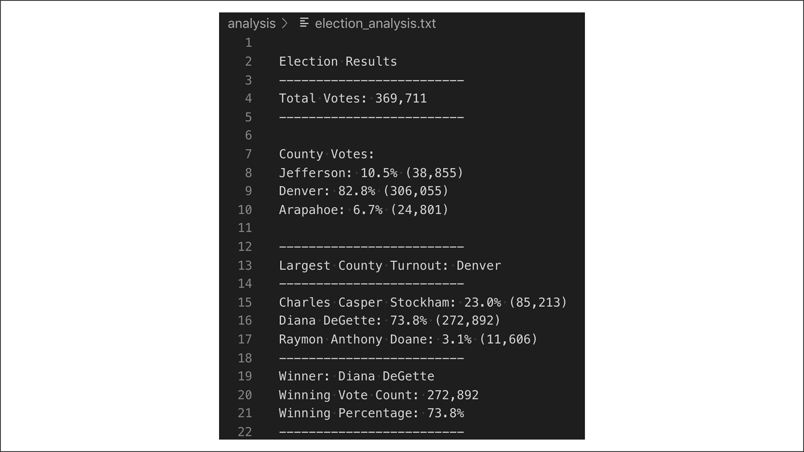

# Overview of Election Audit: Explain the purpose of this election audit analysis.
A Colorado Board of elections employee has given us a list of data concerning an election involving three different counties, Arapahoe, Denver, and Jefferson. One of the objectives is to extract the data from the CSV file in order to tally the amount of votes each candidate received. The main purpose is to determine which of the counties had the highest voter turnout, what percentage of the votes it consisted of, and then to determine the winner of the election.

## Resources
- Data Source: election_results.csv
- Software: Python 3.7.6, VSC 1.64.0
- [Image of County Turnout and Vote Data](n.d.). https://courses.bootcampspot.com/courses/1197/files/1381719/preview

## Election-Audit Results: Using a bulleted list, address the following election outcomes. Use images or examples of your code as support where necessary.

* **How many votes were cast in this congressional election?** There was a total of 369,711 votes.

* **Provide a breakdown of the number of votes and the percentage of total votes for each county in the precinct.**
For the county of Arapahoe, there was a total of 24,801 votes, which consisted of approximately 6.7% of the total votes. For the county of Denver, there was a total of 306, 055 votes, which consisted of approximately 82.8% of the total votes. For the county of Jefferson, there was a total of 38,855 votes, which consisted of 10.5% of the total votes.

* **Which county had the largest number of votes?**
The county with the largest number of votes was Denver.

* **Provide a breakdown of the number of votes and the percentage of the total votes each candidate received.**
Charles Casper Stockham received 23.0% of the vote; a total of 85,213 votes. Diana DeGette received 73.8% of the vote; a total of 272,892 votes. Raymon Anthony Doane received 3.1% of the vote; a total of 11,606 votes.

* **Which candidate won the election, what was their vote count, and what was their percentage of the total votes?**
The winning candidate was Diana DeGette, who had a total of 272,892 votes, which consisted of 73.8% of the total votes.

## Election-Audit Summary: In a summary statement, provide a business proposal to the election commission on how this script can be used—with some modifications—for any election. Give at least two examples of how this script can be modified to be used for other elections.
For this particular election, we can see the discrepancy in voter turnout amongst the different counties. There are a few questions that can be asked in using this script: 1) How large is the population in each county? 2) Compared to the population in each county, how was voter turnout within each county? 3) Depending on the answer from the previous question asked, how can one increase voter turnout? In asking the third question, we need to also examine the policies within the state that could either improve or deter voter turnout. 
	One way to we can modify this script is to use it for larger elections for the whole state. Possibly, it could read data from a list consisting of all counties in the state. Then we can examine whether Denver would still be the top county for highest voter turnout. Another way we could modify this is break the counties into their different districts and examine microscopically which districts are voting the most. As stated above, however, population density can affect voter turnout as well.

